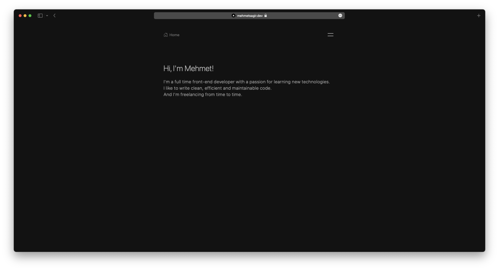

<div align="center">
<a target="_blank" href="https://mehmetsagir.dev">
    
</a>

[](https://mehmetsagir.dev)
[](https://github.com/mehmetsagir/mehmetsagir.dev/blob/master/LICENSE)
[](https://vercel.com/import/project?template=https://github.com/mehmetsagir/mehmetsagir.dev)
[](https://vercel.com/home?utm_source=nuro&utm_campaign=oss)

</div><br/>

## Getting Started

Install dependencies:

```bash
npm install
# or
yarn
```

First, run the development server:

```bash
npm run dev
# or
yarn dev
```

Open [http://localhost:3000](http://localhost:3000) with your browser to see the result.

## Learn More

To learn more about Next.js, take a look at the following resources:

- [Next.js Documentation](https://nextjs.org/docs) - learn about Next.js features and API.
- [Learn Next.js](https://nextjs.org/learn) - an interactive Next.js tutorial.

## Deploy on Vercel

The easiest way to deploy your Next.js app is to use the [Vercel Platform](https://vercel.com/new?utm_medium=default-template&filter=next.js&utm_source=create-next-app&utm_campaign=create-next-app-readme) from the creators of Next.js.

Check out our [Next.js deployment documentation](https://nextjs.org/docs/deployment) for more details.

## Author

Mehmet Sağır

---

## License

Licensed under the MIT license, see [LICENSE](LICENSE) for details.
